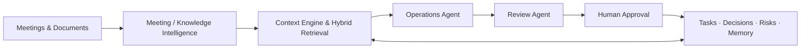

# OpsPilot AI

**An open-source operations workspace that turns meetings, documents, and project activity into decisions, tasks, risks, and durable organizational memory.**

[简体中文](README.zh-CN.md) · English

[](https://github.com/Router0824/OpsPilot-AI/actions/workflows/ci.yml)
[](LICENSE)
[](https://nextjs.org/)
[](https://fastapi.tiangolo.com/)

OpsPilot AI is a portfolio-ready, full-stack product for practical AI operations. It brings knowledge retrieval, meeting follow-up, task coordination, decision history, risk detection, workflow review, and operational analytics into one inspectable workspace.

The repository runs end to end in deterministic Demo Mode without an API key. Live mode supports OpenAI, Azure OpenAI, and DeepSeek through a shared structured-output boundary.


<p align="center"><sub>Workspace health, active work, decisions, risks, and automation outcomes in one operational view.</sub></p>

## Why OpsPilot

Teams rarely lack information; they lack continuity. Important context is scattered across meeting notes, documents, task boards, and chat. Decisions lose their rationale, action items lose their owners, and recurring status work stays manual.

OpsPilot connects that operating loop:

```text
Information → Knowledge → Decision → Action → Workflow → Memory
```

## Product preview

The screenshots below come from the bundled synthetic workspace. The complete interface can switch between English and Simplified Chinese; the preview uses the Simplified Chinese locale.

<table>
  <tr>
    <td width="50%">
      
      <br /><strong>Task Board</strong> — drag work across four stages, edit complete task context, and focus on blocked, overdue, or unassigned items.
    </td>
    <td width="50%">
      
      <br /><strong>Meeting Intelligence</strong> — analyze raw notes and review structured decisions, actions, risks, and questions before saving.
    </td>
  </tr>
  <tr>
    <td width="50%">
      
      <br /><strong>Knowledge Center</strong> — upload, parse, chunk, and index project sources for inspectable hybrid retrieval.
    </td>
    <td width="50%">
      
      <br /><strong>Workflow Automation</strong> — run repeatable meeting, document, reporting, and risk workflows with approval gates.
    </td>
  </tr>
</table>


<p align="center"><sub>Observed workflow throughput, approval state, latency, and clearly labelled time-saving estimates.</sub></p>

## Product capabilities

- **Meeting Intelligence** — turns meeting notes into a reviewable summary, decisions, action items, owners, deadlines, risks, and open questions.
- **Knowledge Center** — parses PDF, TXT, and Markdown files and exposes traceable retrieval results.
- **Operations Copilot** — answers questions about project status, blockers, overdue work, and recent changes from current workspace state.
- **Interactive Task Board** — supports drag and drop, complete task editing, quick creation, owner and priority filters, overdue signals, and attention views.
- **Decision Memory** — preserves decisions, rationale, confidence, and source context for future work.
- **Risk Tracking** — detects blocked work, missing ownership, deadlines, unresolved dependencies, and conflicting decisions.
- **Workflow Automation** — packages recurring operations such as meeting follow-up, document indexing, weekly reporting, and risk detection.
- **Human review** — keeps proposed writes pending until a person approves or rejects them.
- **Activity audit and analytics** — records workflow status, approval, feedback, latency, context size, tool calls, and token usage when available.
- **Bilingual interface** — provides persistent English and Simplified Chinese UI across the complete product.

## How work moves through the system

1. **Capture** — a user uploads a source document, pastes meeting notes, creates a task, or asks an operational question.
2. **Structure** — document and meeting services normalize input into typed Pydantic models rather than unvalidated free-form text.
3. **Retrieve** — the Context Engine selects relevant documents, decisions, memory, tasks, risks, and meetings within a bounded context budget.
4. **Reason** — the selected provider returns workflow-specific structured output; Demo Mode returns deterministic fixtures through the same service boundary.
5. **Review** — write-oriented proposals remain pending so a person can edit, approve, or reject them.
6. **Commit and observe** — approved records enter workspace state while the run, tools, latency, retrieval trace, feedback, and approval state remain auditable.

| Surface | Typical input | Produced state | Human control |
|---|---|---|---|
| Meeting Intelligence | Raw meeting notes | Summary, decisions, tasks, risks, questions | Edit and approve selected records |
| Knowledge Center | PDF, TXT, Markdown | Parsed documents and retrievable chunks | Choose uploaded sources |
| Operations Copilot | Status or planning question | Grounded operational answer | Helpful / not-helpful feedback |
| Plan Generation | Workspace goal | Milestones, dependencies, owners, expected outputs | Review generated tasks on the board |
| Risk Detection | Live workspace state | Explainable risk proposals | Approve or reject before write |
| Weekly Report | Tasks, decisions, risks, recent runs | Current status and next priorities | Read-only generated report |

## Demo walkthrough

The bundled `AI Knowledge Assistant Launch` workspace demonstrates the product with synthetic data:

1. Review workspace health, active risks, decisions, and milestones.
2. Analyze the seeded kickoff meeting and review the proposed records.
3. Edit and approve decisions, tasks, and risks before they enter workspace memory.
4. Use the Task Board to inspect blocked, overdue, or unassigned work.
5. Ask Operations Copilot for a weekly status or the next priorities.
6. Inspect the activity audit and operational analytics.

## Architecture



```text
apps/web/                 Next.js 16 + React 19 interface
backend/app/api/          FastAPI routes
backend/app/agents/       Operations workflow orchestration
backend/app/context/      Token-budgeted context builder
backend/app/retrieval/    Local vector + keyword hybrid retrieval
backend/app/services/     LLM, meeting, planning, document, and risk services
backend/app/demo/         Deterministic synthetic workspace
backend/migrations/       Alembic migrations for SQLite and PostgreSQL
backend/tests/            Backend behavior and migration tests
docs/                     Product, architecture, and evaluation notes
```

The default database is SQLite for zero-configuration local use. The same SQLAlchemy repository layer and Alembic history support PostgreSQL for production deployments.

More detail: [Architecture](docs/architecture.md) · [Product brief](docs/product.md) · [Evaluation](docs/evaluation.md)

## Implementation details

### Hybrid retrieval

Uploaded documents are parsed into source-aware chunks. Retrieval combines deterministic feature-hashed cosine similarity, keyword coverage, phrase signals, and importance metadata. The merged top-k result keeps document and chunk identifiers so evaluation can inspect why context was selected. The local implementation is intentionally lightweight and replaceable with provider embeddings or pgvector.

### Context engineering and memory

`build_workspace_context()` allocates a fixed token budget across the workspace goal, documents, formal decisions, memory, active tasks, risks, meetings, and recent conversation. The allocation changes with the request: blocker questions prioritize tasks and risks, while decision questions prioritize decisions and source documents. Project, decision, meeting, and activity memory are stored separately so durable facts are not mixed with transient conversation.

### Structured outputs and provider boundary

Meeting analysis, planning, and operational answers are validated against typed schemas before they reach application state. OpenAI, Azure OpenAI, and DeepSeek adapters share the same application-facing interface. Provider credentials and model selection stay in the backend environment.

### Human review and observability

Approval and usefulness are separate concepts. Approval controls whether a proposed write changes workspace state; helpful / not-helpful feedback evaluates an existing result. Each run can record its workflow, input type, status, tools, latency, context size, token usage, groundedness, output, and review outcome.

## API surface

FastAPI exposes interactive documentation at `/docs`. The main endpoint groups are:

| Endpoint family | Responsibility |
|---|---|
| `/api/workspaces` | Workspace creation, dashboard state, and complete workspace retrieval |
| `/api/workspaces/{id}/documents` | Document ingestion, parsing, chunking, and indexing |
| `/api/workspaces/{id}/meetings/*` | Meeting analysis and reviewed record persistence |
| `/api/workspaces/{id}/tasks` and `/api/tasks/{id}` | Task creation, partial editing, and status movement |
| `/api/workspaces/{id}/copilot` | Workspace-aware operational questions |
| `/api/workspaces/{id}/automations/*` | Weekly reporting and approval-based risk detection |
| `/api/workspaces/{id}/activity` | Workflow run history, filters, review, and feedback |
| `/api/workspaces/{id}/analytics` | Operational throughput and run-health metrics |
| `/api/workspaces/{id}/evaluation` | Retrieval traces and evaluation evidence |

## Technology

- Next.js 16, React 19, TypeScript
- FastAPI, Pydantic, SQLAlchemy, Alembic
- SQLite; optional PostgreSQL 17 + Psycopg
- OpenAI Responses API, Azure OpenAI, and DeepSeek provider adapters
- Deterministic local hybrid retrieval and PyPDF extraction
- Docker Compose and GitHub Actions

## Quick start

Prerequisites: Node.js 22+, Python 3.11+, and [`uv`](https://docs.astral.sh/uv/).

```bash
git clone https://github.com/Router0824/OpsPilot-AI.git
cd OpsPilot-AI
cp .env.example .env
make install
```

Start the API:

```bash
make dev-backend
```

Start the web app in another terminal:

```bash
make dev-web
```

Open [http://localhost:3000](http://localhost:3000). API documentation is available at [http://localhost:8000/docs](http://localhost:8000/docs).

## Model configuration

| Mode | External API required | Persistence | Best for |
|---|---:|---|---|
| Demo Mode | No | SQLite by default | Reviewers, screenshots, local exploration |
| Live model + SQLite | Yes | Local file | Product development and provider testing |
| Live model + PostgreSQL | Yes | PostgreSQL volume or managed database | Hosted and multi-session deployments |

Demo Mode is enabled by default and makes no external model requests:

```dotenv
DEMO_MODE=true
```

For live mode, set `DEMO_MODE=false` and configure one supported provider in `.env`:

```dotenv
# DeepSeek
DEEPSEEK_API_KEY=your_key
DEEPSEEK_BASE_URL=https://api.deepseek.com
DEEPSEEK_MODEL=deepseek-flash

# Or OpenAI
OPENAI_API_KEY=your_key
OPENAI_MODEL=gpt-4o-mini

# Or Azure OpenAI
AZURE_OPENAI_API_KEY=your_key
AZURE_OPENAI_ENDPOINT=https://your-resource.openai.azure.com
AZURE_OPENAI_DEPLOYMENT=your-deployment
AZURE_OPENAI_API_VERSION=2024-10-21
```

Credentials are read only from server-side environment variables. They are never bundled into the browser application.

## Tests and quality checks

```bash
make test
```

The command runs backend tests, frontend linting, type checking, and the production Next.js build. CI also validates database migrations and Docker Compose configuration.

## Deployment

### Docker Compose

```bash
cp .env.example .env
docker compose up --build
```

The web app runs on port `3000`, the API on `8000`, and SQLite data persists in a named volume.

For PostgreSQL:

```bash
docker compose -f docker-compose.yml -f docker-compose.postgres.yml up --build
```

### Vercel + Railway or Render

1. Deploy `backend/` as a Docker service with persistent storage or PostgreSQL.
2. Configure `CORS_ORIGINS` and the required model-provider variables.
3. Deploy `apps/web/` to Vercel with `apps/web` as the root directory.
4. Set `NEXT_PUBLIC_API_URL` to the public API origin.
5. Verify `/api/health`, migrations, CORS, upload limits, and persistent storage.

## Security and data handling

- `.env`, local databases, uploads, caches, and build artifacts are excluded from version control.
- The repository contains synthetic demo content only.
- Write-oriented workflows require explicit human approval.
- Uploaded content stays on the configured backend and is not embedded in the frontend bundle.
- Demo Mode makes no external API call.

## Roadmap

- Authentication, workspace membership, and role-based access
- Background ingestion, OCR, and connector-based synchronization
- PostgreSQL + pgvector and provider embeddings
- Labelled retrieval and groundedness benchmarks
- Streaming workflow runs and a visual workflow editor
- Configurable retention, memory consolidation, and approval policies

## Contributing

Issues and focused pull requests are welcome. Keep Demo Mode deterministic, add tests for changed behavior, and run `make test` before submitting.

## License

Released under the [MIT License](LICENSE).
