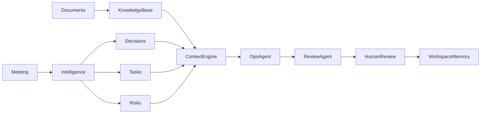

# OpsPilot AI

**AI-native workspace for knowledge management, workflow automation, and organizational intelligence.**

Modern teams generate large amounts of information through meetings, documents, and day-to-day project work. OpsPilot transforms that fragmented information into **knowledge, decisions, tasks, risks, automated workflows, and organizational memory**.

## Business Problem

Critical context is scattered across meeting notes, project briefs, research, task lists, and decision logs. Teams repeatedly summarize the same information, lose the reasoning behind decisions, and rely on manual follow-up after every meeting.

OpsPilot turns that operating burden into a connected workflow:

**Information → Knowledge → Decision → Action → Workflow → Memory**

Its product surface is AI Operations: meeting follow-up, knowledge management, decision tracking, task coordination, risk detection, weekly reporting, and human approval. Under the hood it uses LLM agents, hybrid RAG, context engineering, structured outputs, memory, and typed tools.

> No API key? Try Demo Mode. The complete product runs with deterministic synthetic data.

## Demo

The seeded **AI Knowledge Assistant Launch** workspace tells the full product story in under three minutes:

1. Open the workspace dashboard and inspect current knowledge, decisions, and active work.
2. Analyze the prefilled launch meeting; edit the proposed records, then approve decisions, tasks, and risks.
3. Open the four-stage Task Board and see the blocked, unowned data-permissions task.
4. Ask Operations Copilot for the weekly status, overdue work, or what changed.
5. Inspect Decision Memory and the evidence-driven Risk Tracker.
6. Open Operations Analytics to inspect workflow throughput, approval, latency, and clearly labelled time-saved estimates.

> A repository GIF can be recorded from this deterministic flow without configuring a model provider. The running UI is also designed for clean portfolio screenshots at 1440×900.

## Live Demo

Deploy the frontend to Vercel and the API to Railway or Render using the instructions below. Until a public URL is attached, `docker compose up --build` provides the same production build locally.

## Features

- **Bilingual product UI** — persistent English / Simplified Chinese language switching across the public site and complete workspace, with shared loading, success, error, focus, and interaction feedback.
- **Meeting Intelligence** — structured summary, decisions, confidence, action items, owners, deadlines, risks, and questions with review before write.
- **Operations Copilot** — weekly status, overdue work, workspace changes, blockers, and next priorities from live operational state.
- **Hybrid RAG** — local vector similarity + keyword coverage + rank fusion, with inspectable top-k scores.
- **Context Engine** — task-aware token allocation instead of dumping the complete workspace into the prompt.
- **Project Memory** — semantic, decision, and episodic memory with importance-aware retrieval.
- **Risk Tracker** — evidence-backed risks from blocked work, missing ownership, deadlines, meetings, and documents.
- **Plan Generation** — goal decomposition into milestones, tasks, dependencies, priorities, owners, and expected outputs.
- **Interactive Task Board** — four-stage drag-and-drop execution board with optimistic updates, explicit keyboard-friendly movement controls, ownership and overdue signals, inline creation, filtering, and expandable task context.
- **Human in the loop** — edit, approve, or reject AI-generated meeting outputs before they become organizational memory.
- **Executable Automation Gallery** — productized Meeting → Tasks, Decision Memory, Document Indexing, Weekly Report, and Risk Detection workflows; write runs remain pending until human approval.
- **AI Activity & Approval Audit** — filterable workflow history with explicit input type, execution status, human approval, helpfulness feedback, tools, latency, token usage, and recorded output.
- **Evaluation & observability** — retrieval traces, latency, provider token usage, context size, tool calls, groundedness, and feedback.
- **Demo Mode** — complete synthetic workspace and deterministic Agent workflow with no API key.

## Architecture



The application is a small monorepo:

```text
apps/web/                 Next.js 16 + TypeScript product UI
backend/app/api/          FastAPI routes
backend/app/agents/       Operations-oriented agent orchestration
backend/app/context/      Token-budgeted context builder
backend/app/retrieval/    Vector + keyword hybrid retrieval
backend/app/services/     Documents, LLM, meetings, planning, repositories
backend/app/demo/         Synthetic seed workspace
backend/migrations/       Versioned SQLite/PostgreSQL schema
backend/tests/            Context, memory, meeting, and planning tests
docs/                     Product, architecture, and evaluation notes
```

SQLite is the zero-configuration default. Persistence goes through SQLAlchemy and a shared Alembic history, so a PostgreSQL `DATABASE_URL` can be supplied without changing domain code. See [architecture details](docs/architecture.md).

## How It Works

```text
Documents → parse → chunk → index
Request   → context budget → hybrid retrieval → memory retrieval
          → Knowledge Agent → Operations Agent → Review Agent
          → structured response + citations → episodic memory + metrics
```

PDF, TXT, and Markdown uploads are parsed locally. Each chunk stores its source, document ID, chunk ID, text, and metadata. The MVP vector retriever uses deterministic feature-hashed term vectors with cosine similarity; keyword retrieval uses query-term coverage. A weighted merge plus phrase/importance signals produces the final rank. This is intentionally dependency-light and is not described as an embedding benchmark.

## Agent Workflow

Agents serve operational workflows rather than acting as standalone chatbots.

- **Operations Agent** analyzes workspace health, creates weekly reports, reviews tasks, and detects risks.
- **Knowledge Agent** retrieves documents, formal decisions, and project memory with evidence.
- **Review Agent** checks evidence, decision conflicts, missing context, and structured-output completeness.

Typed tool boundaries include `search_documents`, `search_decisions`, `search_memory`, `get_tasks`, `create_task`, `create_decision`, `create_risk`, and `get_workspace_status`.

Risk Detection evaluates blocked and overdue work, missing owners or deadlines, unresolved dependencies, and potentially conflicting decisions. It returns explainable proposals for approve/reject review and de-duplicates accepted risks by workspace evidence.

## Context Engineering

`build_workspace_context()` dynamically assembles only task-relevant state across the workspace goal, documents, decisions, memory, active tasks, risks, recent meetings, and conversation. Operational questions such as “What is blocked?” shift budget toward tasks, risks, and meetings; decision questions shift it toward formal decisions and source documents. This prevents workspace growth from silently becoming prompt growth.

## Memory System

| Type | Purpose | Example |
|---|---|---|
| Project | Stable project facts | “The pilot targets a 50-person team.” |
| Decision | Choices and their reasons | “Use Azure OpenAI for the MVP.” |
| Meeting | Approved meeting summaries | “Kickoff aligned prototype, knowledge, and permission work.” |
| Activity | Useful operational outcomes | “Data permission task became blocked.” |

Memory retrieval combines relevance with stored importance. Decision memory is included in future context, which helps the reviewer avoid recommending already-rejected approaches.

## Tech Stack

- Next.js 16, React 19, TypeScript, custom responsive design system
- FastAPI, Pydantic structured outputs, SQLAlchemy
- SQLite by default; PostgreSQL 17 + Psycopg production path with Alembic migrations
- OpenAI Responses API with `responses.parse(...)`; Azure OpenAI provider adapter
- PyPDF document extraction; deterministic local hybrid retrieval
- Docker and Docker Compose
- GitHub Actions CI for tests, migrations, frontend builds, and Compose validation

## Quick Start

Prerequisites: Node.js 22+, Python 3.11+, and [`uv`](https://docs.astral.sh/uv/).

```bash
git clone <your-repository-url>
cd opspilot-ai
cp .env.example .env
make install
```

Start the API:

```bash
make dev-backend
```

In another terminal, start the web app:

```bash
make dev-web
```

Open [http://localhost:3000](http://localhost:3000). API docs are available at [http://localhost:8000/docs](http://localhost:8000/docs).

Run all tests and the production frontend build:

```bash
make test
```

### Database migrations

SQLite Demo Mode still starts with zero setup. API startup applies the versioned Alembic schema automatically; a complete database created by an earlier OpsPilot version is safely baselined before upgrades. Production operators can also run migrations explicitly:

```bash
make migrate
make migration-check
```

To run the complete stack against PostgreSQL instead of SQLite:

```bash
docker compose -f docker-compose.yml -f docker-compose.postgres.yml up --build
```

The PostgreSQL overlay waits for database health, applies `alembic upgrade head`, and only then starts the API. Both `postgres://` provider URLs and explicit `postgresql+psycopg://` URLs are normalized by the backend.

## Demo Mode

Demo Mode is on by default:

```dotenv
DEMO_MODE=true
```

On first API startup OpsPilot creates the synthetic **AI Knowledge Assistant Launch** workspace with four documents, an Azure OpenAI decision, four tasks including one blocked item, two risks, meeting history, and operations metrics. No proprietary data or external API call is used.

To use a real model, provide one provider and disable Demo Mode:

```dotenv
DEMO_MODE=false
OPENAI_API_KEY=sk-...
OPENAI_MODEL=gpt-4o-mini
```

Or configure Azure OpenAI:

```dotenv
DEMO_MODE=false
AZURE_OPENAI_API_KEY=...
AZURE_OPENAI_ENDPOINT=https://your-resource.openai.azure.com
AZURE_OPENAI_DEPLOYMENT=your-deployment
AZURE_OPENAI_API_VERSION=2024-10-21
```

Keys are read only from environment variables. Uploaded content is processed by the configured backend and is never bundled into the frontend.

## Evaluation

OpsPilot records observed metrics only:

- top-k chunks and vector / keyword / fused retrieval scores;
- Agent latency, context size, tool calls, and provider token usage when returned;
- Review Agent groundedness: `SUPPORTED`, `PARTIAL`, or `UNSUPPORTED`;
- explicit 👍 helpful / 👎 not-helpful feedback.

The UI deliberately shows no benchmark accuracy until a labelled evaluation set exists. See [evaluation methodology](docs/evaluation.md).

## Deployment

### Docker Compose

```bash
cp .env.example .env
docker compose up --build
```

The web app is available on port `3000`, the API on `8000`, and SQLite data persists in the `opspilot_data` volume.

For the production-style PostgreSQL stack:

```bash
docker compose -f docker-compose.yml -f docker-compose.postgres.yml up --build
```

PostgreSQL data persists in `opspilot_postgres`; the backend container runs migrations before accepting traffic. Replace the local development credentials in `docker-compose.postgres.yml` when adapting this stack for a hosted environment.

### Vercel + Railway / Render

1. Deploy `backend/` as a Docker service and attach a persistent disk or PostgreSQL database.
2. Set `CORS_ORIGINS` to the Vercel origin and add model-provider variables if live mode is required.
3. Deploy `apps/web/` to Vercel with its root directory set to `apps/web`.
4. Set `NEXT_PUBLIC_API_URL` to the public backend origin and redeploy the frontend.
5. Verify `/api/health`, upload limits, CORS, and persistent storage before sharing the demo.

For Azure Container Apps, build the same two Dockerfiles, expose ports 8000/3000 as separate apps, and point the frontend environment variable at the API ingress URL.

## Roadmap

- PostgreSQL + pgvector and provider embeddings for semantic retrieval
- Reciprocal Rank Fusion, cross-encoder reranking, and labelled Recall@K benchmarks
- Future integrations: Notion, Slack, Microsoft Teams, Outlook, Google Calendar, Airtable, GitHub, Zapier, Make, and Microsoft Power Automate
- Background document ingestion and OCR
- Configurable memory consolidation, decay, conflict resolution, and approval policies
- Streaming Agent runs and a visual workflow editor
- Authentication, workspace membership, tamper-evident event export, and retention policies

## Contributing

Issues and focused pull requests are welcome. Keep Demo Mode deterministic, add tests for changed Agent behavior, and do not add proprietary content to fixtures. Run `make test` before submitting.

## License

MIT. See [LICENSE](LICENSE).

## Resume-ready bullets

**中文 — OpsPilot AI｜AI 原生组织知识与运营自动化平台**

- 独立设计并开发 OpsPilot AI，一款面向团队知识管理与运营自动化的 AI-native Workspace，将会议记录、项目文档与任务上下文转化为结构化 Decision、Action Items、Risk 与可跟踪 Workflow。
- 构建 Meeting Intelligence 与 Organizational Memory 模块，实现会议摘要、行动项提取、Owner / Deadline 识别、历史决策沉淀及项目知识检索，降低团队人工信息整理与 Follow-up 成本。
- 设计 Workspace-aware Context Engine，动态融合 Documents、Decision Memory、Tasks、Risks 与历史 Meeting Context，为 Operations Copilot 提供任务相关上下文。
- 基于 FastAPI、Next.js、RAG、LLM Structured Output 与 Tool abstraction 构建端到端产品原型，并实现 Human-in-the-loop Review、AI Activity 审计、Operations Dashboard 与 Docker 化部署。

**English — OpsPilot AI · AI-native Knowledge & Operations Automation Platform**

- Built OpsPilot AI, an AI-native operations workspace that transforms meetings, project documents, and team context into structured decisions, action items, risks, and trackable workflows.
- Developed Meeting Intelligence and Organizational Memory capabilities for automated meeting summarization, task extraction, decision capture, knowledge retrieval, and follow-up management.
- Designed a workspace-aware context engine that dynamically combines documents, decisions, tasks, risks, and meeting history for operational AI workflows.
- Built the end-to-end product using FastAPI, Next.js, RAG, structured LLM outputs, tool abstractions, human-in-the-loop review, workflow audit trails, analytics, and Docker deployment.

---

Demo content is synthetic and contains no proprietary organizational information.
