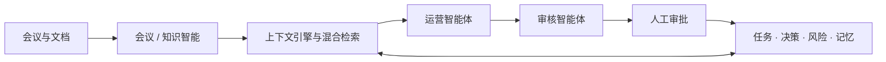

# OpsPilot AI

**将会议、文档与项目动态转化为决策、任务、风险和组织记忆的开源运营工作台。**

简体中文 · [English](README.md)

[](https://github.com/Router0824/OpsPilot-AI/actions/workflows/ci.yml)
[](LICENSE)
[](https://nextjs.org/)
[](https://fastapi.tiangolo.com/)

OpsPilot AI 是一个面向真实团队协作场景的全栈 AI Operations 产品。它将知识检索、会议跟进、任务协调、决策沉淀、风险识别、流程审核和运营分析整合到同一个可追踪的工作区中。

项目默认使用确定性的演示模式，无需 API Key 即可体验完整流程；实时模式支持 OpenAI、Azure OpenAI 和 DeepSeek，并通过统一的结构化输出层保证数据质量。

## 为什么需要 OpsPilot

团队通常并不缺少信息，真正缺少的是信息之间的连续性。关键上下文散落在会议纪要、项目文档、任务看板和聊天记录里，导致决策理由逐渐丢失、行动项无人跟进、项目状态需要反复人工整理。

OpsPilot 将这些环节连接成一个持续运转的闭环：

```text
信息 → 知识 → 决策 → 行动 → 工作流 → 组织记忆
```

## 核心功能

- **会议智能**：从会议记录中提取可审核的摘要、决策、行动项、负责人、截止日期、风险和待确认问题。
- **知识中心**：解析 PDF、TXT 和 Markdown 文件，并展示可追踪的检索结果。
- **运营助理**：根据工作区实时状态回答项目进度、阻塞事项、逾期工作和近期变化。
- **交互式任务看板**：支持拖拽、完整任务编辑、快速创建、负责人和优先级筛选、逾期提示与关注视图。
- **决策记忆**：保留决策内容、原因、置信度和来源上下文，供后续工作复用。
- **风险跟踪**：识别受阻任务、责任人缺失、截止日期、未解决依赖和潜在决策冲突。
- **工作流自动化**：将会议跟进、文档索引、周报生成和风险检测封装为可执行流程。
- **人工审核机制**：所有写入型建议都需要人工批准或拒绝后才会进入正式工作区。
- **活动审计与分析**：记录流程状态、审核结果、用户反馈、延迟、上下文大小、工具调用和可用的 Token 数据。
- **中英双语界面**：完整产品支持英文和简体中文切换，并持久保存语言偏好。

## 演示流程

项目内置 `AI Knowledge Assistant Launch` 合成工作区，可完整演示产品价值：

1. 查看工作区健康度、风险、决策和当前里程碑。
2. 分析预置的项目启动会议并检查结构化结果。
3. 编辑并审核决策、任务和风险，再将其写入工作区记忆。
4. 在任务看板中定位受阻、逾期或无人负责的工作。
5. 向运营助理询问本周进展或下一步优先事项。
6. 在活动记录和运营分析中检查流程执行情况。

## 系统架构



```text
apps/web/                 Next.js 16 + React 19 前端
backend/app/api/          FastAPI 接口
backend/app/agents/       运营工作流编排
backend/app/context/      基于 Token 预算的上下文构建器
backend/app/retrieval/    本地向量 + 关键词混合检索
backend/app/services/     模型、会议、计划、文档与风险服务
backend/app/demo/         确定性的合成演示工作区
backend/migrations/       SQLite / PostgreSQL Alembic 迁移
backend/tests/            后端行为与迁移测试
docs/                     产品、架构与评估说明
```

默认使用 SQLite，适合零配置本地体验；生产环境可通过同一套 SQLAlchemy 数据层与 Alembic 迁移切换到 PostgreSQL。

详细文档：[架构说明](docs/architecture.md) · [产品说明](docs/product.md) · [评估方法](docs/evaluation.md)

## 技术栈

- Next.js 16、React 19、TypeScript
- FastAPI、Pydantic、SQLAlchemy、Alembic
- SQLite；可选 PostgreSQL 17 + Psycopg
- OpenAI Responses API、Azure OpenAI、DeepSeek 适配器
- 确定性本地混合检索与 PyPDF 文档解析
- Docker Compose 与 GitHub Actions

## 快速开始

环境要求：Node.js 22+、Python 3.11+、[`uv`](https://docs.astral.sh/uv/)。

```bash
git clone https://github.com/Router0824/OpsPilot-AI.git
cd OpsPilot-AI
cp .env.example .env
make install
```

启动后端：

```bash
make dev-backend
```

在另一个终端启动前端：

```bash
make dev-web
```

访问 [http://localhost:3000](http://localhost:3000)。API 文档位于 [http://localhost:8000/docs](http://localhost:8000/docs)。

## 模型配置

默认开启演示模式，不会调用任何外部模型：

```dotenv
DEMO_MODE=true
```

如需使用真实模型，请在 `.env` 中设置 `DEMO_MODE=false`，并配置一个模型提供方：

```dotenv
# DeepSeek
DEEPSEEK_API_KEY=your_key
DEEPSEEK_BASE_URL=https://api.deepseek.com
DEEPSEEK_MODEL=deepseek-flash

# 或 OpenAI
OPENAI_API_KEY=your_key
OPENAI_MODEL=gpt-4o-mini

# 或 Azure OpenAI
AZURE_OPENAI_API_KEY=your_key
AZURE_OPENAI_ENDPOINT=https://your-resource.openai.azure.com
AZURE_OPENAI_DEPLOYMENT=your-deployment
AZURE_OPENAI_API_VERSION=2024-10-21
```

所有凭证仅从服务端环境变量读取，不会被打包到浏览器应用中。

## 测试与质量检查

```bash
make test
```

该命令会执行后端测试、前端代码检查、类型检查和 Next.js 生产构建。CI 还会验证数据库迁移和 Docker Compose 配置。

## 部署

### Docker Compose

```bash
cp .env.example .env
docker compose up --build
```

前端运行在 `3000` 端口，API 运行在 `8000` 端口，SQLite 数据保存在命名卷中。

使用 PostgreSQL：

```bash
docker compose -f docker-compose.yml -f docker-compose.postgres.yml up --build
```

### Vercel + Railway 或 Render

1. 将 `backend/` 作为 Docker 服务部署，并连接持久化存储或 PostgreSQL。
2. 配置 `CORS_ORIGINS` 以及需要的模型环境变量。
3. 将 `apps/web/` 部署到 Vercel，并将根目录设置为 `apps/web`。
4. 将 `NEXT_PUBLIC_API_URL` 设置为公开 API 地址。
5. 检查 `/api/health`、数据库迁移、CORS、上传限制和持久化存储。

## 安全与数据处理

- `.env`、本地数据库、上传内容、缓存和构建产物均不会进入版本控制。
- 仓库内只包含合成演示数据，不包含真实组织信息。
- 写入型工作流需要明确的人工批准。
- 上传内容只由配置的后端处理，不会进入前端构建产物。
- 演示模式不会调用外部 API。

## 后续计划

- 身份认证、工作区成员与角色权限
- 后台文档处理、OCR 与连接器同步
- PostgreSQL + pgvector 与模型 Embedding
- 标注式检索和事实一致性评估集
- 流式工作流执行与可视化流程编辑器
- 可配置的数据保留、记忆整合与审核策略

## 参与贡献

欢迎提交 Issue 和范围清晰的 Pull Request。请保持演示模式结果稳定，为行为变更补充测试，并在提交前运行 `make test`。

## 开源协议

项目基于 [MIT License](LICENSE) 发布。
